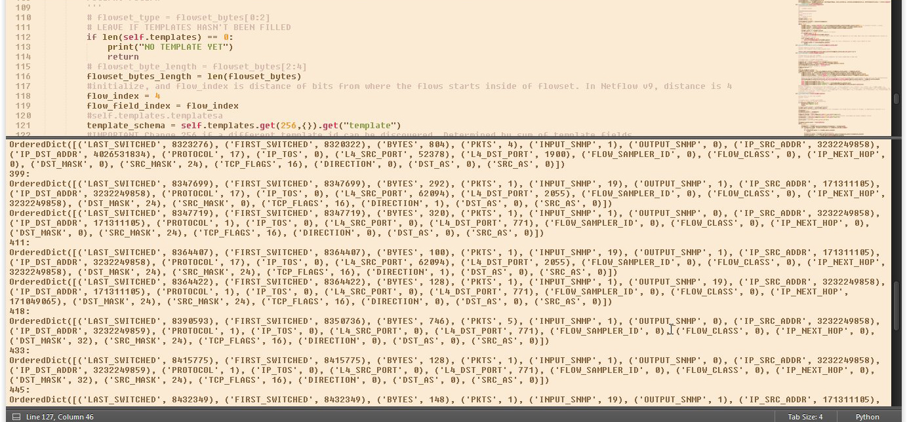

# Packet Analyzer & Netflow Packet Reader

I wanted to attempt doing a Network Sniffer for myself so I could parlay my past programming talent with my CCNP Route & work with Network concepts on a lower level (as low as I could that time would permit). This was done strictly for learning purposes

I was having difficulty with extracting data coming my network interfaces, but I could have done easily through getting a PCAP file in WireShark.

| File | Purpose |
| ------ | ------ |
| packet.php | This will look into a PCAP file and read the bits & bytes of every field in the TCP/IP or UDP Packet. |
| lib/netflow.py | If the packet is a Netflow Packet with flows, it will read the bits/fields of Netflow |
| lib/packet_helper.py | Various utility Functions |



```
[OrderedDict([('LAST_SWITCHED', 8283163),
              ('FIRST_SWITCHED', 8271123),
              ('BYTES', 581),
              ('PKTS', 3),
              ('INPUT_SNMP', 1),
              ('OUTPUT_SNMP', 0),
              ('IP_SRC_ADDR', '192.168.56.2'),
              ('IP_DST_ADDR', '192.168.56.3'),
              ('PROTOCOL', 1),
              ('IP_TOS', 0),
              ('L4_SRC_PORT', 0),
              ('L4_DST_PORT', 771),
              ('FLOW_SAMPLER_ID', 0),
              ('FLOW_CLASS', 0),
              ('IP_NEXT_HOP', 0),
              ('DST_MASK', 32),
              ('SRC_MASK', 24),
              ('TCP_FLAGS', 16),
              ('DIRECTION', 0),
              ('DST_AS', 0),
              ('SRC_AS', 0)]),
 OrderedDict([('LAST_SWITCHED', 8323276),
              ('FIRST_SWITCHED', 8320322),
              ('BYTES', 804),
              ('PKTS', 4),
              ('INPUT_SNMP', 1),
              ('OUTPUT_SNMP', 0),
              ('IP_SRC_ADDR', '192.168.56.2'),
              ('IP_DST_ADDR', '239.255.255.250'),
              ('PROTOCOL', 17),
              ('IP_TOS', 0),
              ('L4_SRC_PORT', 52378),
              ('L4_DST_PORT', 1900),
              ('FLOW_SAMPLER_ID', 0),
              ('FLOW_CLASS', 0),
              ('IP_NEXT_HOP', 0),
              ('DST_MASK', 0),
              ('SRC_MASK', 24),
              ('TCP_FLAGS', 16),
              ('DIRECTION', 0),
              ('DST_AS', 0),
              ('SRC_AS', 0)]),
 OrderedDict([('LAST_SWITCHED', 8347719),
              ('FIRST_SWITCHED', 8347719),
              ('BYTES', 320),
              ('PKTS', 1),
              ('INPUT_SNMP', 1),
              ('OUTPUT_SNMP', 0),
              ('IP_SRC_ADDR', '192.168.56.2'),
              ('IP_DST_ADDR', '10.54.0.1'),
              ('PROTOCOL', 1),
              ('IP_TOS', 0),
              ('L4_SRC_PORT', 0),
              ('L4_DST_PORT', 771),
              ('FLOW_SAMPLER_ID', 0),
              ('FLOW_CLASS', 0),
              ('IP_NEXT_HOP', 0),
              ('DST_MASK', 0),
              ('SRC_MASK', 24),
              ('TCP_FLAGS', 16),
              ('DIRECTION', 0),
              ('DST_AS', 0),
              ('SRC_AS', 0)]),
 OrderedDict([('LAST_SWITCHED', 8364422),
              ('FIRST_SWITCHED', 8364422),
              ('BYTES', 128),
              ('PKTS', 1),
              ('INPUT_SNMP', 1),
              ('OUTPUT_SNMP', 19),
              ('IP_SRC_ADDR', '192.168.56.2'),
              ('IP_DST_ADDR', '10.54.0.1'),
              ('PROTOCOL', 1),
              ('IP_TOS', 0),
              ('L4_SRC_PORT', 0),
              ('L4_DST_PORT', 771),
              ('FLOW_SAMPLER_ID', 0),
              ('FLOW_CLASS', 0),
              ('IP_NEXT_HOP', 171049065),
              ('DST_MASK', 24),
              ('SRC_MASK', 24),
              ('TCP_FLAGS', 16),
              ('DIRECTION', 0),
              ('DST_AS', 0),
              ('SRC_AS', 0)])
 ]
```